# Почему

Я рот ебал стандартных медицинских шприцов, невъебенное решение сделать 30 одинаковых иконок, что бы в критической ситуации с умирающем тиммейтом на руках судорожно перебирать глазами эту размазню.

# О моде

~~Мод SERVER-SIDE, требуется подписка хоста.~~ Мод **CLIENT SIDE ONLY**, нахуй xml \<override\> **Lua powered**.

Мод меняет все ванильные медицинские шприцы на собственные иконки. В игре 5 классов медицины: Medicine, Basic Chemicals, Toxins, Antidotes, Stimulants. Классы в моде соответствуют оф. вики: [Medical Items](https://barotraumagame.com/wiki/Medical_Items)

У каждого класса медицины своя икона, которая уже внутри класса различается по цветам/значкам статусов.

# Совместимость

Мод работает на базе Lua, подменяя спрайты существующих мед префабов, не делая полный XML override самих префабов. Должен быть совместим с любыми модами. 

Особенности:
- Перезапишет мед иконки других XML модов **ВНЕ ЗАВИСИМОСТИ ОТ ПРИОРИТЕТА**
- Иконки могут быть переопределены другим Lua модом, если у него выше приоритет(выше в списке модов barotrauma)

# Редактирование мода

В steam workshop только необходимые файлы для работы мода. Ставьте себе локально(в `Barotrauma/LocalMods`) полную версию с [GitHub](https://github.com/WantBeASleep/MedicalIcons). Мод описан в Agents.md

# Как создавался

Я вообще не умею рисовать, да и с чувством вкуса было так себе. Весь мод написан и нарисован нейронкой Codex 5.5 (да, я генерил картинки на Кодексе).

Благодарность создателю мода https://steamcommunity.com/sharedfiles/filedetails/?id=3539579595 за вдохновение и творческий ориентир.

Буду рад любому фидбеку!

--------------------------------------------------------

--------------------------------------------------------

# English Version

# Why

Fuck the standard medical syringes. What a fucking brilliant decision to make 30 identical icons, so that in a critical situation, with a dying teammate in your hands, you have to frantically scan this smear with your eyes.

# About the Mod

**This is a SERVER-SIDE mod; the host must be subscribed.**

The mod replaces all vanilla medical syringes with custom icons. The game has 5 medical classes: Medicine, Basic Chemicals, Toxins, Antidotes, Stimulants. The classes in the mod match the official wiki: [Medical Items](https://barotraumagame.com/wiki/Medical_Items)

Each medical class has its own icon, and items inside the class are already distinguished by colors and status symbols.

# Compatibility

- The texture pack works correctly with all mods that do not change the vanilla items listed above.
- If you use mods that change vanilla content, move this texture pack to the end of the list. In that case, its texture priority will be lower, so some textures may not appear.
- You can manually rewrite other mods so they reference textures from here. More on that point below.

# Editing the Mod

You can copy this mod into your local mods and fuck with it there however you want. The mod structure is described in the `AGENTS.md` files.

Other mods can reference textures from this mod. In local versions of those mods, replace the texture path in `.xml` files from `Content` to `QoL - Medical icons`.

# How It Was Made

I cannot fucking draw at all, and my sense of taste was pretty damn questionable too. The whole mod was written and drawn by the Codex 5.5 neural network (yes, I generated the images in Codex). The mod is available on [GitHub](https://github.com/WantBeASleep/MedicalIcons). Ideas and contributions are welcome.

Thanks to the creator of https://steamcommunity.com/sharedfiles/filedetails/?id=3539579595 for the inspiration and creative direction.

--------------------------------------------------------

# Item table

| Identifier | Icon | Sprite |
|---|---|---|
| `adrenaline` | 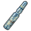 | 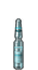 |
| `antibiotics` |  | 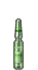 |
| `opium` | 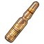 | 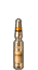 |
| `stabilozine` | 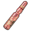 | 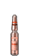 |
| `chloralhydrate` | 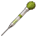 |  |
| `cyanide` | 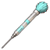 |  |
| `deliriumine` |  | 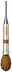 |
| `europabrew` | 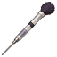 |  |
| `huskeggs` | 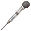 |  |
| `morbusine` |  | 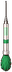 |
| `paralyzant` |  |  |
| `radiotoxin` | 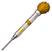 | 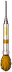 |
| `raptorbaneextract` |  | 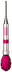 |
| `sufforin` |  | 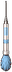 |
| `sulphuricacidsyringe` |  | 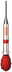 |
| `antidama1` | 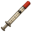 | 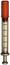 |
| `antidama2` |  | 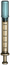 |
| `deusizine` | 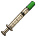 | 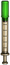 |
| `liquidoxygenite` | 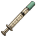 | 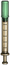 |
| `pomegrenadeextract` | 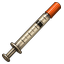 | 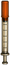 |
| `combatstimulantsyringe` |  | 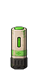 |
| `hyperzine` |  | 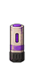 |
| `meth` | 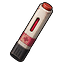 | 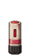 |
| `pressurestabilizer` |  | 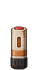 |
| `steroids` |  | 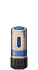 |
| `antinarc` | 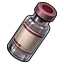 | 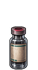 |
| `antiparalysis` |  | 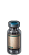 |
| `antipsychosis` | 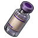 | 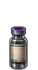 |
| `antirad` |  | 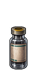 |
| `calyxanide` | 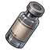 | 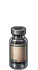 |
| `cyanideantidote` | 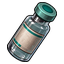 |  |
| `deliriumineantidote` | 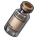 |  |
| `morbusineantidote` |  | 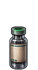 |
| `sufforinantidote` | 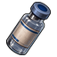 |  |
